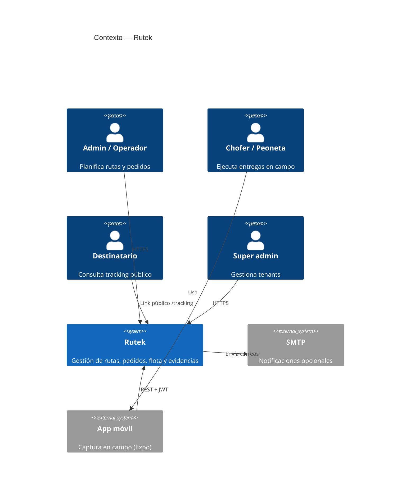
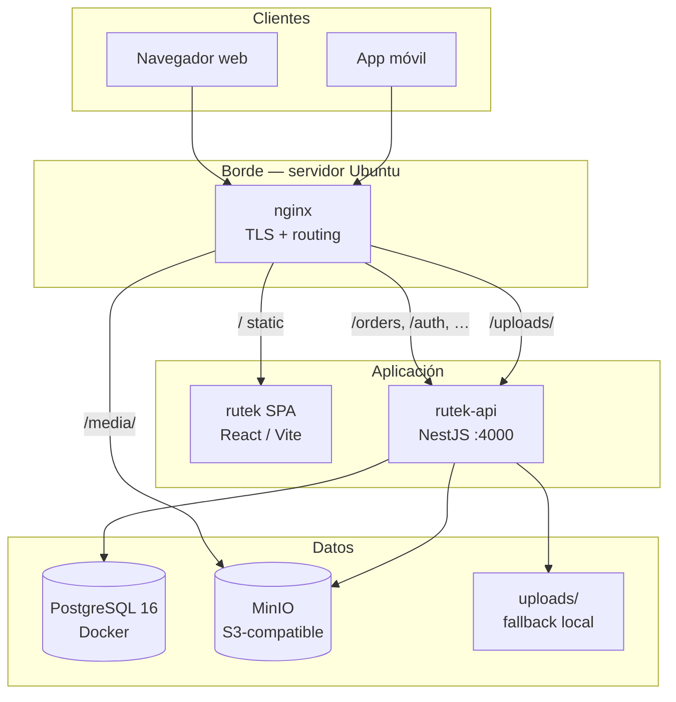
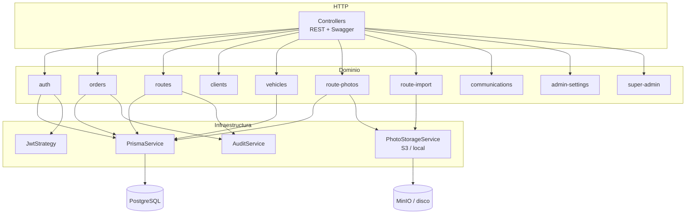
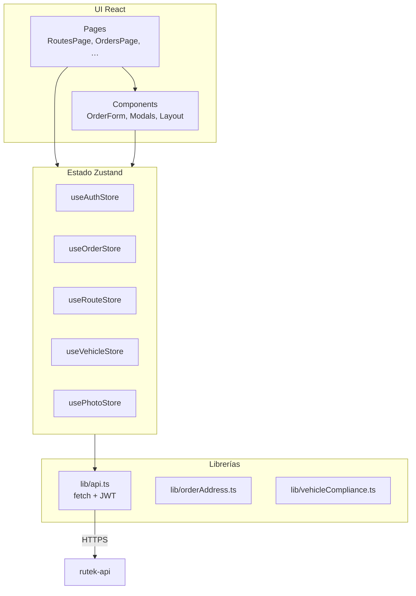
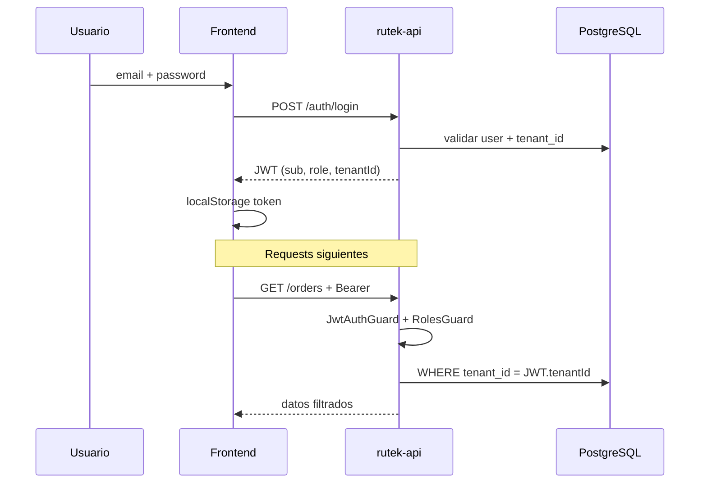
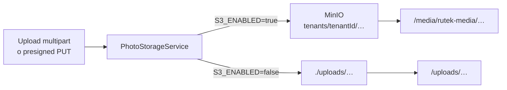

# Arquitectura

Diagramas de alto nivel del sistema Rutek: contexto, contenedores, despliegue y capas internas.

---

## 1. Contexto del sistema

Quién interactúa con Rutek y qué sistemas externos intervienen.



---

## 2. Contenedores

Componentes desplegables y sus responsabilidades.



| Contenedor | Tecnología | Puerto / ruta | Función |
|------------|------------|---------------|---------|
| **SPA** | React build en `/opt/rutek/web/dist` | `/` | UI operativa |
| **API** | NestJS + systemd | `127.0.0.1:4000` | Lógica de negocio, auth |
| **PostgreSQL** | Docker `postgres:16-alpine` | `127.0.0.1:5432` | Persistencia relacional |
| **DbGate** | Docker | `127.0.0.1:5050` (solo túnel SSH) | Explorador SQL web |
| **MinIO** | Docker | `9000` (S3), `9001` (consola local) | Fotos, Excel importados, docs vehículos |
| **nginx** | Ubuntu package | `443` HTTPS | Terminación TLS, reverse proxy |

---

## 3. Despliegue en producción

Topología típica en `rutek.mardev.cl` (script `deploy-from-local.sh`).

```mermaid
flowchart LR
  subgraph dev [Máquina desarrollo]
    Mac[Mac + SSH]
  end

  subgraph server [Servidor Mardev-Sandbox]
    direction TB
    Nginx2[nginx<br/>Let's Encrypt]
    Systemd[rutek-api.service]
    DC[docker compose]
    PG2[(rutek-postgres)]
    M2[(rutek-minio)]
    D2[rutek-dbgate<br/>127.0.0.1:5050]
    WebDir[/opt/rutek/web/dist]
    ApiDir[/opt/rutek/api]
    UpDir[/opt/rutek/uploads]
  end

  Mac -->|rsync + remote-setup| ApiDir
  Mac -->|rsync frontend| WebDir
  Nginx2 --> WebDir
  Nginx2 --> Systemd
  Nginx2 --> M2
  Systemd --> ApiDir
  Systemd --> PG2
  Systemd --> M2
  Systemd --> UpDir
  DC --> PG2
  DC --> M2
  DC --> D2
```

### Acceso a herramientas internas (túnel SSH)

Servicios que **no** están en internet pública: DbGate (`5050`), consola MinIO (`9001`), Postgres (`5432`). Acceso desde la Mac de desarrollo:

```bash
bash rutek-api/deploy/mcp/start-tunnel.sh
```

Documentación: **[rutek-api/deploy/README-SERVICIOS-TUNEL.md](../../rutek-api/deploy/README-SERVICIOS-TUNEL.md)** e **[MCP + modelos locales](../../rutek-api/deploy/mcp/README-MCP-CURSOR.md)**.

### Rutas nginx (resumen)

| Ruta | Destino |
|------|---------|
| `/` | SPA (`try_files` → `index.html`) |
| `/auth`, `/orders`, `/routes`, … | Proxy → API `:4000` |
| `/media/` | Proxy → MinIO bucket `rutek-media` |
| `/uploads/` | Proxy → API (archivos locales) |

### Scripts relevantes

| Script | Ubicación | Propósito |
|--------|-----------|-----------|
| `deploy-from-local.sh` | `rutek-api/deploy/` | Deploy completo desde Mac |
| `remote-setup.sh` | idem | Build, migrate, seed, nginx, systemd |
| `reset-prod-data.sh` | idem | `migrate reset` + limpieza MinIO |
| `docker-compose.prod.yml` | idem | Postgres + MinIO + DbGate |
| `README-SERVICIOS-TUNEL.md` | idem | Túneles SSH, servicios |
| `mcp/README-MCP-CURSOR.md` | idem | Cursor + Postgres MCP + Ollama |

---

## 4. Capas internas del API

Módulos NestJS y dependencias transversales.



---

## 5. Frontend — estructura lógica



El **hub operativo** principal es `RoutesPage`: listado de rutas, panel lateral de pedidos, asignación masiva e import Excel.

---

## 6. Multi-tenant y seguridad



- **JWT HS256** con `tenantId` y `role` en payload.
- Guards globales: autenticación + RBAC por decorador `@Roles`.
- `super_admin`: acceso cross-tenant vía módulo dedicado.
- Tracking público: tokens opacos sin JWT (`TrackingToken`).

---

## 7. Almacenamiento de archivos

Estrategia dual según configuración `S3_ENABLED`.



Prefijos típicos en bucket:

- `tenants/{tenantId}/routes/{routeId}/…` — evidencias de ruta/pedido
- `tenants/{tenantId}/vehicles/{vehicleId}/documents/…` — docs de flota
- `tenants/{tenantId}/imports/…` — backup de Excel importados

---

## Referencias

- [Visión general](./vision-general.md)
- [Flujos de secuencia](./flujos-secuencia.md)
- [Módulo vehículos](../../rutek-api/docs/modulo-vehiculos.md)
