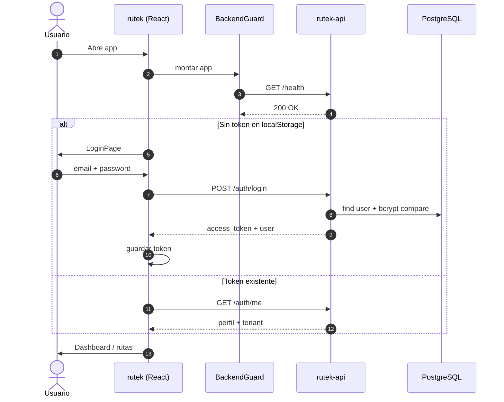
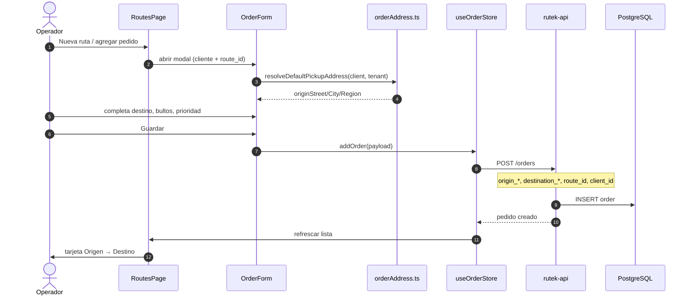
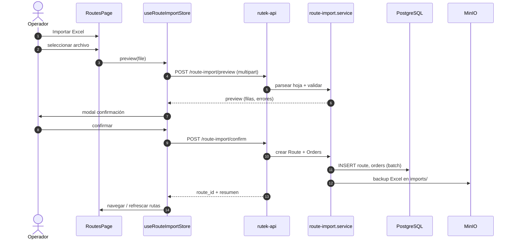
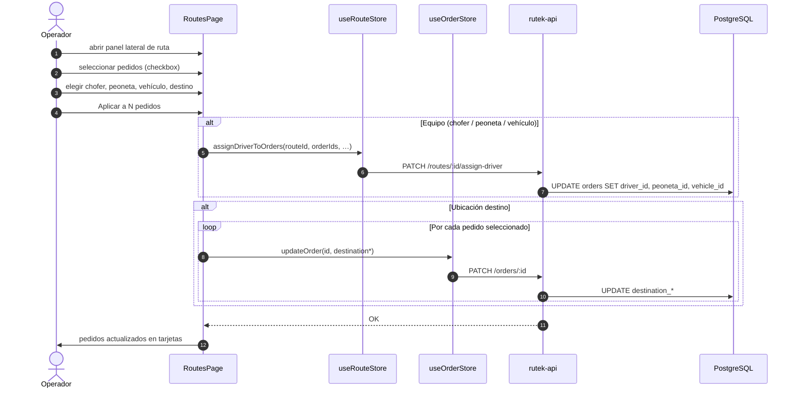
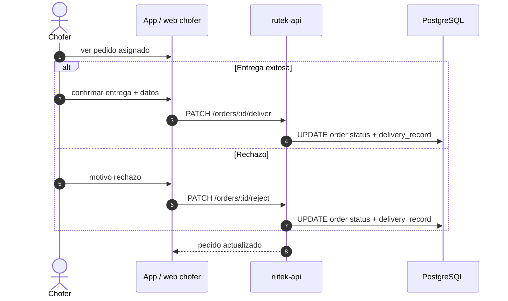
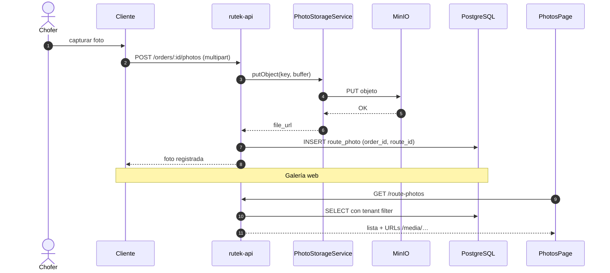
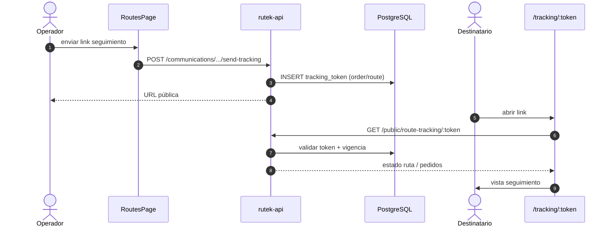
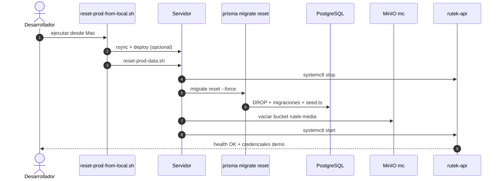

# Flujos de secuencia

Diagramas de secuencia de los procesos principales de Rutek. Nivel alto: omiten validaciones y errores salvo donde son relevantes.

---

## 1. Autenticación y sesión

---

## 2. Creación de pedido (origen y destino)

El origen por defecto proviene de la dirección del **mandante (cliente)** de la ruta; si no hay, de la **dirección del tenant**.

---

## 3. Importación Excel de ruta

Crea ruta + pedidos en lote; guarda copia del archivo en MinIO.

---

## 4. Asignación masiva en ruta

Aplica chofer, peoneta, vehículo y/o destino a **pedidos seleccionados** (RM-1: persistencia por pedido).

---

## 5. Entrega o rechazo en campo

Flujo típico desde app móvil o web de chofer (RM-4).

---

## 6. Subida de evidencia (foto)

Camino web multipart; la app móvil puede usar flujo presigned (documentado en API README).

---

## 7. Seguimiento público

Sin autenticación; token opaco con vigencia limitada.

---

## 8. Reset de datos demo (operaciones)

Flujo usado en servidor para limpiar y resembrar (no es UI de producto).

---

## Referencias

- [Arquitectura](./arquitectura.md)
- [Visión general](./vision-general.md)
- OpenAPI: `http://localhost:4000/api/docs`
