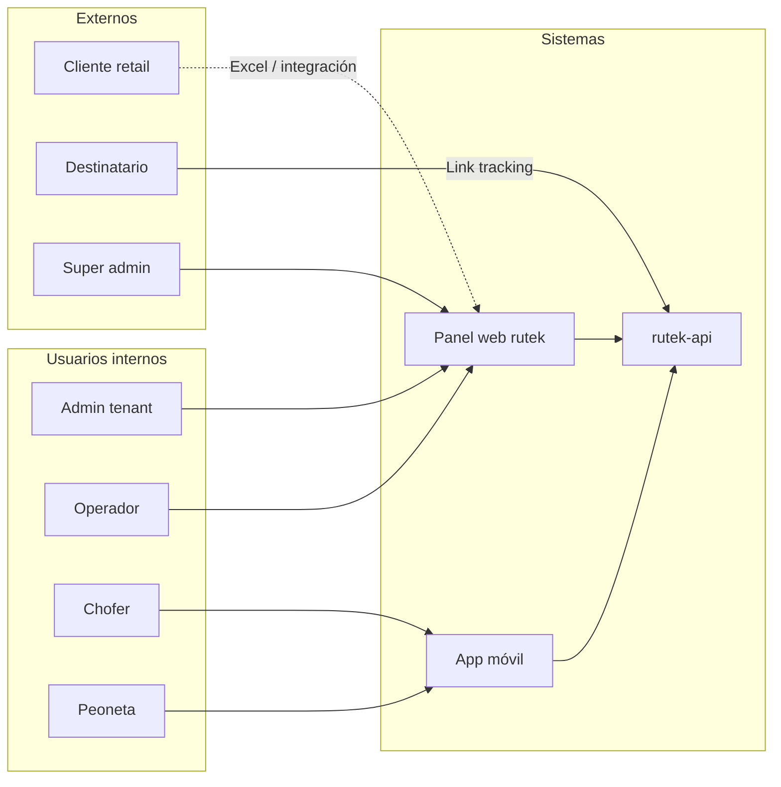
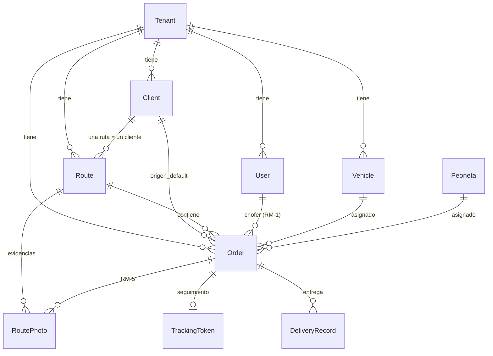

# Visión general

## Qué es Rutek

Rutek es una plataforma B2B para **empresas de transporte y última milla** que operan pedidos de clientes retail (mandantes). Permite:

- Planificar **rutas** por cuenta/mandante
- Gestionar **pedidos** con origen y destino
- Asignar **chofer, peoneta y vehículo** por pedido
- Registrar **entregas, rechazos y evidencias** (fotos, firmas)
- Administrar **flota** y cumplimiento documental
- Ofrecer **seguimiento público** por token

Cada **tenant** (empresa transportista) opera en aislamiento lógico. Un rol **super_admin** gestiona tenants a nivel global.

---

## Actores

| Rol | Acceso típico |
|-----|----------------|
| `super_admin` | Tenants, usuarios globales, auditoría |
| `admin` | Configuración tenant, usuarios, flota, rutas |
| `operator` | Operación diaria: rutas, pedidos, asignaciones |
| `driver` | Rutas/pedidos propios, entregas, fotos |
| `peoneta` | Vista simplificada de rutas asignadas |
| `client` | Acceso acotado (cuando aplica) |

---

## Módulos funcionales

| Módulo | Frontend | API | Descripción |
|--------|----------|-----|-------------|
| Auth | `LoginPage`, `useAuthStore` | `/auth/*` | Login JWT, sesión, roles |
| Clientes | `ClientsPage` | `/clients` | Cuentas mandantes (Ripley, etc.) |
| Pedidos | `OrdersPage`, `OrderForm` | `/orders` | CRUD, origen/destino, estados |
| Rutas | `RoutesPage` | `/routes`, `/route-import` | Planificación, import Excel, bulk assign |
| Flota | `VehiclesPage` | `/vehicles` | Vehículos y documentos |
| Evidencias | `PhotosPage` | `/route-photos`, `/orders/:id/photos` | Galería y captura en campo |
| Dashboard | `Dashboard` | `/dashboard` | KPIs operativos |
| Configuración | `SettingsPage` | `/admin-settings`, `/tenant/*` | Tenant, flags, estados custom |
| Super admin | `/super-admin/*` | `/super-admin/*` | Multi-tenant global |
| Tracking público | `/tracking/*` | `/public/*` | Seguimiento sin login |

---

## Stack tecnológico

### Frontend (`rutek`)

- **Vite 8** + **React 19** + **TypeScript**
- **React Router 7** — rutas y deep links
- **Zustand** — estado por dominio (`useOrderStore`, `useRouteStore`, …)
- **Tailwind CSS** — UI, modo oscuro
- **fetch** vía wrapper `src/lib/api.ts` (Bearer JWT)

### Backend (`rutek-api`)

- **NestJS 11** — módulos por dominio
- **Prisma 6** — ORM sobre **PostgreSQL 16**
- **Passport JWT** + **bcrypt**
- **AWS SDK v3** — cliente S3 compatible con **MinIO**
- **SheetJS (xlsx)** — importación Excel de rutas

### Infraestructura

- **Docker Compose** — Postgres + MinIO + DbGate en servidor
- **nginx** — SPA estática, proxy API, proxy `/media/` a MinIO
- **systemd** — servicio `rutek-api` en producción
- Deploy desde Mac: `rutek-api/deploy/deploy-from-local.sh`
- Túneles SSH + IA local (Cursor MCP): [README-SERVICIOS-TUNEL.md](../../rutek-api/deploy/README-SERVICIOS-TUNEL.md), [MCP Cursor](../../rutek-api/deploy/mcp/README-MCP-CURSOR.md)

---

## Modelo de datos (resumen)

Entidades centrales y cardinalidad simplificada:

### Reglas de negocio clave

| ID | Regla |
|----|--------|
| **RM-1** | Chofer, peoneta y vehículo se asignan **por pedido**, no solo a nivel ruta |
| **RM-3** | Cada ruta pertenece a **un solo cliente** mandante |
| **RM-4** | Entrega/rechazo atómico vía endpoints dedicados del pedido |
| **RM-5** | Fotos de evidencia ligadas preferentemente al **pedido** |
| **RM-7** | Retención de fotos configurable por tenant |

---

## Entornos

| Entorno | Frontend | API | Base de datos |
|---------|----------|-----|---------------|
| Desarrollo local | `:5173` | `:4000` | Docker Postgres local |
| Producción | `https://rutek.mardev.cl` | nginx → `:4000` | Postgres + MinIO en servidor |

En producción el frontend usa **mismo origen** (`VITE_API_URL` vacío): nginx sirve la SPA y enruta `/orders`, `/auth`, etc. al API.

---

## Próximos documentos

- [Arquitectura](./arquitectura.md) — diagramas de sistema y despliegue
- [Flujos de secuencia](./flujos-secuencia.md) — login, pedidos, rutas, evidencias
